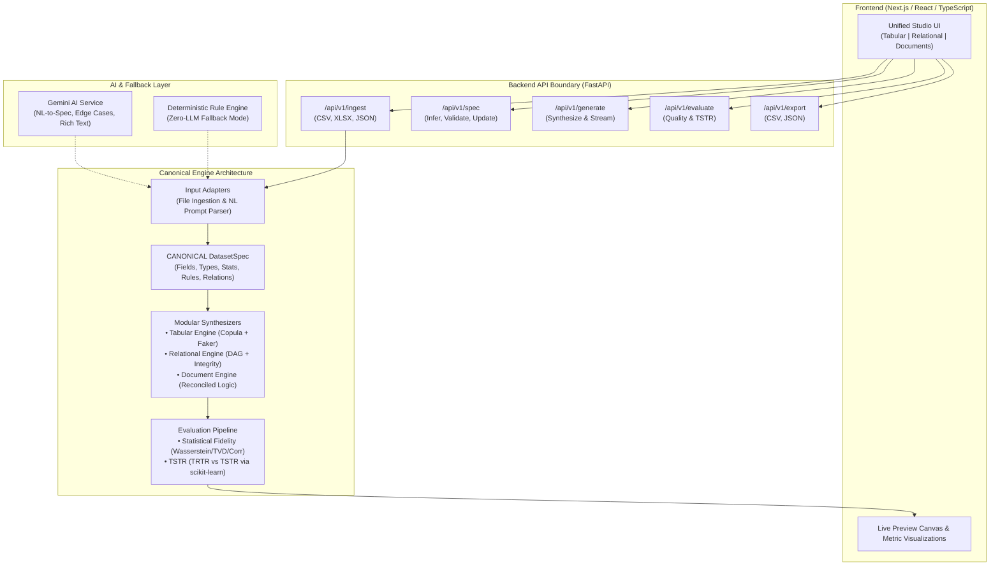

# ARCHITECTURE.md — System Architecture & Design Principles

The Synthetic Data Platform is designed around a single unifying principle: **all inputs normalize into a Canonical `DatasetSpec`, and all synthesis engines consume that same specification.**

---

## 1. High-Level System Architecture



---

## 2. The Central Abstraction: Canonical `DatasetSpec`

To satisfy the official hackathon requirement that tabular, relational, and document generators share one schema-aware pipeline, the platform does **not** hardcode domain-specific generators. Instead, all configurations serialize into a structured `DatasetSpec`:

```json
{
  "name": "ecommerce_orders",
  "version": "1.0",
  "locale": "en_US",
  "seed": 42,
  "tables": [
    {
      "name": "customers",
      "row_count": 1000,
      "primary_key": "customer_id",
      "columns": [
        {
          "name": "customer_id",
          "dtype": "integer",
          "semantic_type": "id",
          "constraints": { "unique": true, "auto_increment": true }
        },
        {
          "name": "email",
          "dtype": "string",
          "semantic_type": "email",
          "privacy_rule": "mask"
        },
        {
          "name": "income",
          "dtype": "float",
          "semantic_type": "numeric",
          "distribution": { "type": "gaussian", "mean": 55000, "std": 12000 },
          "null_rate": 0.02,
          "outlier_rate": 0.01
        }
      ]
    },
    {
      "name": "orders",
      "row_count": 3500,
      "primary_key": "order_id",
      "foreign_keys": [
        { "column": "customer_id", "reference_table": "customers", "reference_column": "customer_id", "cardinality": "1:N" }
      ],
      "columns": [...]
    }
  ],
  "cross_table_rules": [
    {
      "rule_type": "reconciliation",
      "parent_column": "orders.total_amount",
      "child_expression": "SUM(order_items.quantity * order_items.unit_price)"
    }
  ]
}
```

---

## 3. Modular Generation Engines

1. **Tabular Synthesizer (P0)**:
   - Uses Gaussian Copula / distribution fitting for numerical correlations.
   - Frequency-weighted random sampling for categorical columns.
   - Semantic generators (Faker) for identities, emails, dates, and locations.
   - Seeded NumPy/Python random states for strict deterministic reproducibility.
   - Column privacy transformations applied post-generation (masking, SHA-256 hashing, Laplace/differential noise).

2. **Relational Synthesizer (P1)**:
   - Resolves dependencies as a Directed Acyclic Graph (DAG) (Parent tables first, then Child tables).
   - Generates parent PKs, then samples child FKs preserving cardinality rules (1:1, 1:N, N:N).
   - Validates zero orphan records before returning.

3. **Document Synthesizer (P2)**:
   - Operates on relational schema projections (Invoices = Header $\to$ Line Items; Bank Statements = Account $\to$ Ordered Transactions).
   - Enforces mathematical balance invariants:
     $$\text{Invoice Total} = \sum (\text{Qty} \times \text{Price}) + \text{Tax} - \text{Discount}$$
     $$\text{Balance}_t = \text{Balance}_{t-1} + \text{Credit}_t - \text{Debit}_t$$

---

## 4. Evaluation Architecture

### 4.1 Statistical Fidelity
- **Numeric Columns**: 2-sample Kolmogorov-Smirnov test and Wasserstein distance.
- **Categorical Columns**: Total Variation Distance (TVD) and Jensen-Shannon divergence.
- **Correlations**: Matrix Frobenius norm distance between Real and Synthetic correlation matrices:
  $$D_{corr} = \| C_{real} - C_{synth} \|_F$$
- **Overall Quality Score**: Normalized composite percentage (0% to 100%).

### 4.2 TSTR Pipeline (Train on Synthetic, Test on Real)
1. **Split**: Split real dataset into $D_{real}^{train}$ (80%) and $D_{real}^{test}$ (20%) using stratified sampling if target is categorical.
2. **Synthesize**: Fit synthesizer **only** on $D_{real}^{train}$; generate $D_{synth}^{train}$.
3. **TRTR Benchmark**: Train scikit-learn model (LightGBM/RandomForest/LogisticRegression) on $D_{real}^{train}$, evaluate on $D_{real}^{test}$.
4. **TSTR Run**: Train the identical pipeline on $D_{synth}^{train}$, evaluate on untouched $D_{real}^{test}$.
5. **Output**: Tabulated comparison showing TRTR, TSTR, absolute delta, and Retention Score.

---

## 5. Resilience & AI Layer Architecture

- **Independent Operations**: The core platform runs completely without AI APIs.
- **AI Task Isolation**:
  - `prompt_to_spec`: Natural language $\to$ validated JSON `DatasetSpec`.
  - `semantic_tagger`: Suggests semantic types from sample column names and values.
  - `edge_case_suggester`: Proposes realistic domain anomalies (e.g., negative balances, leap years).
- **Safety Rule**: No dynamic code (`eval`, `exec`) is executed from AI responses. All outputs must pass strict Pydantic schema validation.

---

## 6. Runtime & Deployment Architecture

- **Stateless Backend**: Ingested and generated datasets reside in memory or transient temp files tied to session tokens; cleaned up automatically.
- **No Heavy Infrastructure**: No external relational database, Redis, or GPU instances required for MVP.
- **Free-Tier Target**: Backend runs on standard Python 3.10+ Linux/Windows instances; frontend deploys directly to Vercel or Node.js containers.
