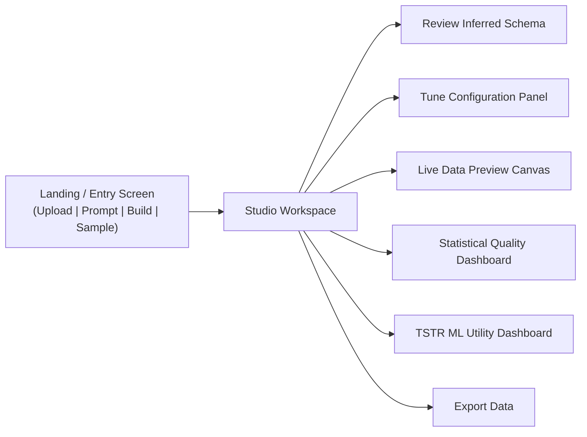

# DESIGN.md — User Interface & Experience Design

This document specifies the screen layouts, navigation flow, and critical UI states for the Synthetic Data Platform.

---

## 1. Primary User Flow



---

## 2. Main Screens & Layout

### 2.1 Entry Screen (`/`)
A clean, purposeful entry interface presenting four clear starting actions:
1. **[ Upload Dataset ]**: Drag-and-drop zone supporting `.csv`, `.xlsx`, `.json`.
2. **[ Describe With AI ]**: Free-text prompt input (e.g., *"Generate 2000 loan applicants with income, credit score, and default status"*).
3. **[ Build Schema ]**: Interactive visual builder to define tables and columns from scratch.
4. **[ Try Sample Dataset ]**: One-click instant loaders for pre-packaged datasets:
   - *Customer Churn* (Classification benchmark)
   - *Loan Portfolio* (Risk regression/classification)
   - *E-commerce Orders* (Relational multi-table)

---

### 2.2 Studio Workspace (`/workspace`)
A high-efficiency 3-column data engineering workspace:

```
+-------------------+---------------------------------------------+-----------------------+
|  MODE NAVIGATOR   |            MAIN CANVAS AREA                 |  CONFIGURATION PANEL  |
|                   |                                             |                       |
|  [Tabular] (P0)   |  Tabs: [Preview] [Schema] [Quality] [TSTR]  |  • Row Count (slider) |
|  [Relational] (P1)|                                             |  • Seed (int / rand)  |
|  [Documents] (P2) |  +---------------------------------------+  |  • Null Rate (%)      |
|                   |  | Active Tab View:                      |  |  • Outlier Rate (%)   |
|  ---------------- |  | - Data Table with type chips          |  |  • Locale & Currency  |
|  Datasets / Tables|  | - Distribution Histograms             |  |  • Privacy Controls:  |
|  • customers      |  | - Correlation Heatmaps                |  |    - Masking          |
|  • orders (P1)    |  | - TSTR Model Comparison Chart         |  |    - Hashing          |
|                   |  +---------------------------------------+  |    - Differential Noise
|                   |                                             |                       |
|                   |  [ Export CSV / JSON ]                      |  [ Regenerate Data ]  |
+-------------------+---------------------------------------------+-----------------------+
```

#### Left Column: Mode & Table Navigator
- Switches between **Tabular**, **Relational**, and **Documents** modes.
- Lists active tables in the current project session.

#### Center Column: Main Canvas & Analytics
- **Data Preview Tab**: Virtualized, sortable grid rendering the first $N$ generated rows with semantic type badges.
- **Schema Tab**: Column-by-column breakdown of primitive types, semantic roles, constraints, and distributions.
- **Quality Tab**: Visual statistical fidelity charts (real vs synthetic overlays, TVD metrics, correlation delta matrix).
- **TSTR Tab**: Side-by-side performance cards (TRTR vs TSTR Accuracy, F1, MAE/RMSE, Retention Percentage) and target selector.

#### Right Column: Configuration & Privacy Sidebar
- Direct knobs for Row Count, Seed, Null/Outlier Injection.
- Privacy transformation toggles per column (Hash, Mask, Noise).
- One-click **Regenerate** trigger with status indicator.

---

## 3. Critical UI & System States

| State | Visual Indicator & User Guidance |
| :--- | :--- |
| **Idle / Ready** | Clear indicators showing active schema and ready status. |
| **Ingesting / Processing File** | Progress spinner displaying file parsing and schema inference status. |
| **Generation in Progress** | Pulsing generator badge with live progress counter (e.g., *"Synthesizing 10,000 rows..."*). |
| **Backend Unavailable** | Persistent top warning banner: *"Backend disconnected. Check server status on port 8000."* |
| **Invalid / Unsupported File** | Non-blocking modal alert: *"Unsupported format. Please upload CSV, XLSX, or JSON."* |
| **AI Unavailable (Fallback)** | Subtle indicator: *"AI service offline. Using deterministic heuristic inference."* Generates data normally without blocking. |
| **TSTR Unavailable** | Informational alert in TSTR tab: *"TSTR requires a designated supervised target column. Select a target column in the Schema tab to run ML utility tests."* Statistical quality remains fully accessible. |
| **Export Success** | Toast notification with auto-triggered file download. |
